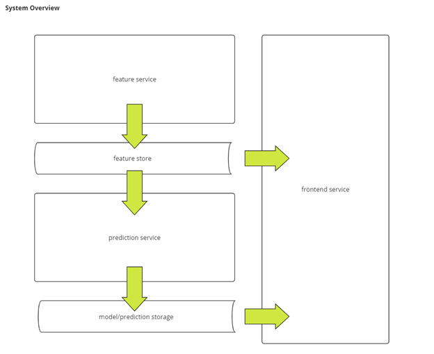
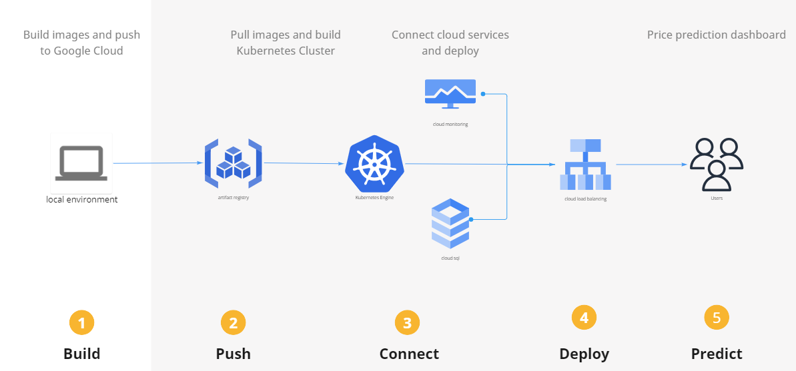

# Price Prediction App
Price Prediction App provides the basic infrastructure to train, compare, and deploy machine learning models to classify future price movements for different financial assets. This README details a system overview and high level deployment steps for the different services involved.

[project presentation PDF link](./documentation/price_prediction_app_presentation.pdf)

link: http://34.28.12.19/

blog:  ???

## System Overview
The application was designed with three indepedent containerized services cooridinated in a single Kubernetes Engine cluster and two Cloud hosted databases.



- Feature Service: connects with polygon.io and AlphVantage APIs and samples minute, hour and daily data and commits to feature service database to be used by the application's feature store.
- Prediction Service: samples active prediction models and commits to prediction service database every hour.
- Frontend Service: connected to feature service and prediction service database and serves as the application's user interface.

## System Diagram


## Main project Google Cloud Kubernetes Deployment


1. Initialize Google Cloud
```bash
gcloud init
```


2. Create a GKE Cluster for the project (use current if available)
```bash
gcloud container clusters create project-cluster \
  --zone=us-central1-a \
  --machine-type=n1-standard-4 \
  --num-nodes=3
```


3. Configure 'kubectl' to gcloud cluster
```bash
gcloud container clusters get-credentials project-cluster
```


4. Create project-secrets for Google cloudsql database credentials secrets
```bash

kubectl delete secret cloudsql-db-credentials

kubectl create secret generic cloudsql-db-credentials \
    --from-literal=db_feature_service_name=feature-service-db \
    --from-literal=db_prediction_service_name=prediction-service-db \
    --from-literal=db_mlflow_name=mlflow-db \
    --from-literal=username=??? \
    --from-literal=password=??? \
    --from-literal=db_name=feature-service-db \
    --from-literal=db_host=??? \
    --from-literal=db_port=???
```


5. View service specific directory for README.md files on next deployment steps