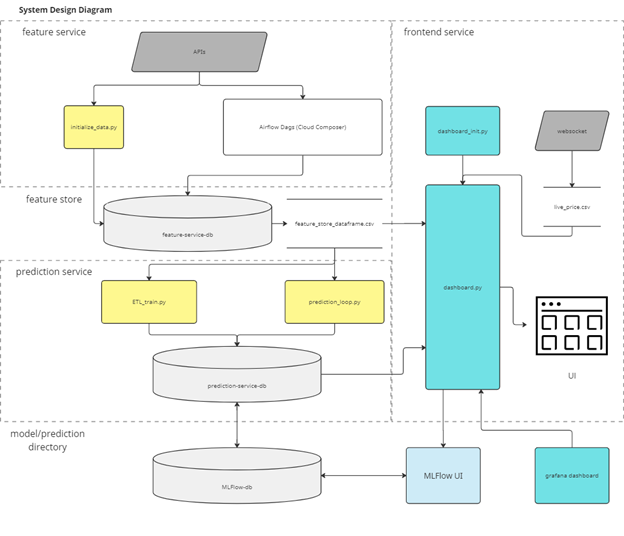

# Price Prediction App

## System Overview


### details
- item
- item
1. item_1
2. item_2

## System Diagram


### details
- item
- item
1. item_1
2. item_2


## Main project Google Cloud Kubernetes Deployment

1. Initialize Google Cloud
```bash
gcloud init
```


2. Create a GKE Cluster for the project (use current if available)
```bash
gcloud container clusters create project-cluster \
  --zone=us-central1-a \
  --machine-type=n1-standard-4 \
  --num-nodes=3
```


3. Configure 'kubectl' to gcloud cluster
```bash
gcloud container clusters get-credentials project-cluster
```


4. Create project-secrets for Google cloudsql database credentials secrets
```bash
kubectl create secret generic cloudsql-db-credentials \
    --from-literal=db_feature_service_name=feature-service-db \
    --from-literal=db_prediction_service_name=prediction-service-db \
    --from-literal=username=user \
    --from-literal=password=postgres \
    --from-literal=db_name=feature-service-db \
    --from-literal=db_host=172.30.192.3 \
    --from-literal=db_port=5432
```


5. View service specific directory for README.md files on next deployment steps